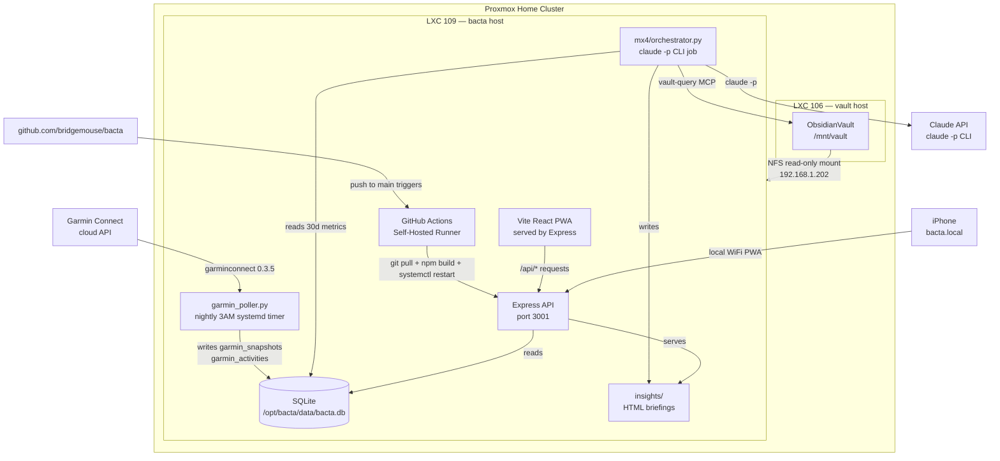

# Bacta — System Architecture

## System Diagram



---

## Stack

Verified against `package.json` (not CLAUDE.md).

| Layer | Technology | Version |
|---|---|---|
| Frontend | React | 19.2 |
| Frontend | TypeScript | 6.0 |
| Frontend | Vite | 8.0 |
| Frontend | React Router | 7.16 |
| Backend | Express | 5.2 |
| Backend | TypeScript (tsx) | 4.21 |
| Database | SQLite via better-sqlite3 | 12.9 |
| Testing | Vitest | 4.1 |
| Testing | Testing Library (React) | 16.3 |
| CI | GitHub Actions, self-hosted runner on LXC 109 | — |
| Python | garminconnect | 0.3.5 |
| MX-4 | Claude Code CLI (`claude -p`) | — |

Note: `@tailwindcss/vite` is installed as a dev dependency and `@import "tailwindcss"` appears in `client/index.css`. However, **no Tailwind utility classes are used in any component** — all component styles are inline. Tailwind's global reset/base layer is applied but the utility system is not used in this project.

---

## App Shell Model

The app is a fixed iOS-style viewport. There is no page scroll — only the content zone scrolls.

```
<html> / <body> — position: fixed; overflow: hidden
└── #root (position: fixed; inset: 0)
    └── <AppShell section={...}>
        ├── <TopBar />          — ~52px, fixed at top
        │   (home mode) BACTA·OS + idle MX4Sigil + MX-4 ONLINE indicator
        │   (section mode) back chevron + section Sigil + channel label
        ├── content zone        — flex: 1; overflow-y: auto; padding: 13px 13px 20px
        │   (section pages render here)
        ├── <BottomBar />       — fixed at bottom, always MX-4 cyan
        │   left: Ask MX-4 circle (listen sigil, breathing glow)
        │   center: Overview/Trends toggle (built sections only)
        │   right: Nav circle (hex menu icon)
        ├── <BottomSheet />     — NavSheet (All Systems), slides up
        └── <AskSheet />        — Ask MX-4 sheet, slides up
```

The background texture (`bactaTexture`) covers the full viewport with section-accented scanlines. The content zone is the only scrollable region. `position: fixed; overflow: hidden` on the outer shell is why Playwright `fullPage` screenshots only capture the viewport — use `browser_evaluate` to set `scrollTop` before screenshotting scrolled content.

---

## Component Tree

Verified against the actual filesystem (`client/src/`).

```
client/src/
├── theme.ts                          Design tokens — authoritative source
├── main.tsx                          React entry point
├── App.tsx                           React Router routes
├── declarations.d.ts                 Module type declarations
│
├── lib/
│   ├── hexA.ts                       hexA(hex, alpha) → rgba string
│   ├── bactaTexture.ts               bactaTexture(accent) → scanline/grid CSS background
│   ├── TabContext.ts                 Overview/Trends tab state context
│   ├── InfoCardContext.tsx           InfoCard overlay context (metric explanations)
│   ├── garminApi.ts                  Client-side Garmin API fetch helpers
│   └── stubData.ts                   Static stub data — BRIEFS (MX-4 text), metric shapes
│
├── components/
│   ├── AppShell.tsx                  Fixed iOS viewport shell
│   ├── TopBar.tsx                    BactaStatusBar (home + section variants)
│   ├── BottomBar.tsx                 BactaDock (Ask + toggle + nav)
│   ├── BottomSheet.tsx               NavSheet (All Systems slide-up)
│   ├── AskSheet.tsx                  Ask MX-4 slide-up sheet
│   ├── Sheet.tsx                     Animated bottom-sheet wrapper primitive
│   ├── MX4Card.tsx                   TransmissionPanel + MX4Briefing + deprecated MX4Card
│   ├── MetricTile.tsx                SystemCard + MetricTile (Home grid)
│   └── SectionShell.tsx             Calibrating skeleton for unbuilt sections
│
├── components/primitives/
│   ├── MX4Sigil.tsx                  6-mood aperture sigil (transmit/idle/listen/think/alert/pleased)
│   ├── Sigil.tsx                     Per-section geometric line glyph icons
│   ├── NavIcon.tsx                   Hexagonal menu icon
│   ├── Ring.tsx                      Circular progress ring (SVG)
│   ├── Sparkline.tsx                 Area sparkline (SVG)
│   ├── StatusCore.tsx                Breathing status dot with ping ring
│   ├── ReadinessDots.tsx             1–5 dot readiness indicator
│   ├── Bracket.tsx                   Four-corner console bracket ticks
│   └── FTelemetry.tsx               Animated telemetry bar graph
│
├── components/viz/
│   ├── Bars7.tsx                     7-bar chart, today highlighted
│   ├── BodyBattery.tsx               Charge-cell bar (min→max band + marker)
│   ├── Delta.tsx                     ▲/▼ change badge with lowerBetter support
│   ├── Gauge.tsx                     270° arc gauge with centered value
│   ├── HeadlineCard.tsx              Two-up headliner metric card shell
│   ├── HealthStatusTile.tsx          Overnight vitals tile with StatusCore badge
│   ├── IntensityBar.tsx              Stacked moderate/vigorous intensity bar
│   ├── LoadBand.tsx                  Horizontal load band with optimal zone
│   ├── LogEntry.tsx                  Activity log line (expandable)
│   ├── Rail.tsx                      Section divider rail with accent label
│   ├── SleepDepth.tsx                Topographic sleep depth area chart (SVG)
│   ├── StageDistribution.tsx         Sleep stage bar + breakdown rows + footer
│   ├── StageLegend.tsx              Stage color swatch + name + duration legend
│   ├── StageSplit.tsx               Proportional stage bar (horizontal)
│   ├── StatusBanner.tsx              Training status hero panel
│   ├── TrendRow.tsx                  Trends-tab row: label/value/delta + sparkline
│   ├── VitalTile.tsx                 Compact secondary metric tile with sparkline
│   └── ZoneDistribution.tsx          HR zone vertical list with bars + summary footer
│
├── hooks/
│   ├── useHomeData.ts                Home SystemCard live data
│   ├── useRecoveryData.ts            Recovery live data (HRV, battery, vitals)
│   ├── useSleepData.ts               Sleep live data (stages, score, SpO2)
│   ├── useTrainingData.ts            Training live data (status, zones, activities)
│   └── useSyncState.ts             Sync button state (polling /api/garmin/sync/status)
│
└── pages/
    ├── HomePage.tsx                  Overview: MX4Briefing + SystemCard grid; Trends: cross-channel
    ├── RecoveryPage.tsx              Overview: gauge + HRV + vitals; Trends: 6 metric rows
    ├── SleepPage.tsx                 Overview: depth field + stages; Trends: duration + score
    ├── TrainingPage.tsx              Overview: status + zones + log; Trends: intensity + load
    ├── NutritionPage.tsx             SectionShell (calibrating — no data)
    ├── BloodWorkPage.tsx             SectionShell (calibrating — no data)
    └── DailyLogPage.tsx              SectionShell (calibrating — no data)
```

---

## Express API Routes

All routes are defined in `server/api/` and mounted in `server/index.ts`.

| Method | Path | Purpose |
|---|---|---|
| `GET` | `/api/health` | Health check — returns `{ status: 'ok', timestamp }` |
| `GET` | `/api/garmin/summary` | Latest available value per metric (uses per-metric MAX(date)) |
| `GET` | `/api/garmin/activities?days=7` | Last N days of activities (max 30), newest first |
| `GET` | `/api/garmin/sync/status` | Current sync state: `idle | running | done | error` |
| `POST` | `/api/garmin/sync` | Spawn garmin_poller.py; returns 202 immediately |
| `GET` | `/api/garmin/weekly-volume?weeks=6` | Weekly training volume in hours |
| `GET` | `/api/garmin/weekly-intensity` | Current Garmin-week mod+vig intensity minutes |
| `GET` | `/api/garmin/weekly-avg-hr?weeks=6` | Weekly average HR from activities |
| `GET` | `/api/garmin/activities/:id/legs` | Leg data for multi-sport activity |
| `GET` | `/api/garmin/:metric?from=&to=` | Single metric — today's value, or date range if both params given |
| `GET` | `/api/insights/:section` | Insight for section — reads from `mx4_briefings` DB table, falls back to stub JSON |
| `GET` | `/api/manual` | Manual daily inputs (readiness, caffeine, supplements) |
| `POST` | `/api/manual` | Save manual daily inputs |
| `GET` | `/api/bloodwork` | Blood work markers |
| `POST` | `/api/poll/force` | Write `data/poll_signal` to trigger manual Garmin poll |
| `POST` | `/api/mx4/run` | Write `data/mx4_signal` to trigger MX-4 orchestrator |

**Route ordering note:** Specific routes (`/activities`, `/sync/status`, `/weekly-volume`, `/weekly-intensity`, `/weekly-avg-hr`) must be defined **before** the `/:metric` wildcard in `garmin.ts`, or Express swallows them. This is a documented bug class in this codebase.

**Briefing pipeline:** The TypeScript orchestrator (`server/lib/ai/orchestrator.ts`) writes structured briefings to the `mx4_briefings` DB table. `insights.ts` reads from that table and returns the `content_json` field, falling back to stub JSON when no briefing exists. All four sections (home, recovery, sleep, training) produce live briefings on each orchestrator run.

---

## Data Flow

### Garmin Metrics

```
Garmin Connect API
    ↓ (garminconnect 0.3.5, authenticated via ~/.garminconnect)
scripts/garmin_poller.py
    ↓ nightly 3AM via bacta-garmin.timer (systemd)
    ↓ or triggered by POST /api/poll/force (writes poll_signal, check_signal.py picks up)
SQLite garmin_snapshots (EAV: date, metric, value, unit, source_json)
SQLite garmin_activities (one row per activity)
SQLite garmin_activity_legs (one row per leg of multi-sport activities)
    ↓
Express /api/garmin/*
    ↓
React hooks (useRecoveryData, useSleepData, useTrainingData, useHomeData)
    ↓
Section pages → viz components
```

### MX-4 Intelligence

```
SQLite (30-day window, pre-fetched by orchestrator)
Obsidian Vault (NFS /mnt/vault, via vault-query MCP)
    ↓
mx4/orchestrator.py
    ↓ claude -p --mcp-config mx4/mcp-config.json
    ↓ system prompt: mx4/system-prompt.md
    ↓ sections: mx4/sections.py
Claude API (via Claude Code CLI)
    ↓
insights/{section}.html   ← HTML fragment per section
    ↓
Express /api/insights/:section
    ↓
TransmissionPanel / AskSheet
```

Manual trigger: `POST /api/mx4/run` writes `data/mx4_signal`, then `mx4/check_signal.py` (runs every minute via cron) detects the file and executes the orchestrator.

---

## Infrastructure

**systemd service:** `bacta-api` — runs `node /opt/bacta/dist/server/index.js` in production. Restarted by the CI deploy workflow on every push to `main`.

**systemd timer:** `bacta-garmin.timer` — fires `bacta-garmin.service` at 3AM daily to run `garmin_poller.py`.

**Self-hosted CI runner:** Installed on LXC 109 with labels `bacta, self-hosted`. The deploy workflow runs on this runner; the test workflow runs on `ubuntu-latest` (GitHub-hosted).

**CI pipeline (push to main):**
1. `git pull` + `npm ci` + `npm run build` (TypeScript compile + Vite bundle)
2. `sudo systemctl restart bacta-api`
3. `curl -sf http://localhost:3001/api/health` (health check)

**CI pipeline (all branches, PRs):**
1. Type check server: `npx tsc -p tsconfig.server.json --noEmit`
2. Type check client: `npx tsc --noEmit`
3. `npm run test:server` + `npm run test:client`

**Vault NFS mount:** LXC 106 exports `/mnt/vault` to LXC 109. Read-only. MX-4's `vault_query_server.py` reads from `VAULT_WIKI_ROOT=/mnt/vault/wiki`.

**Garmin auth:** Tokens stored at `~/.garminconnect` on LXC 109. Run `scripts/garmin_auth.py` to re-authenticate if tokens expire.
